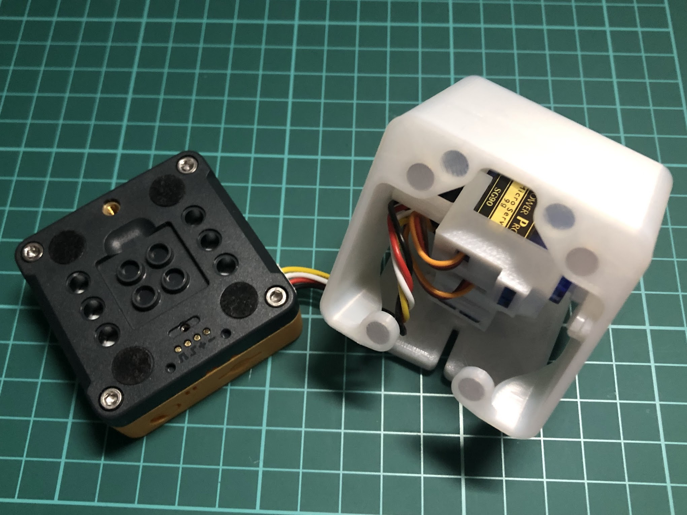
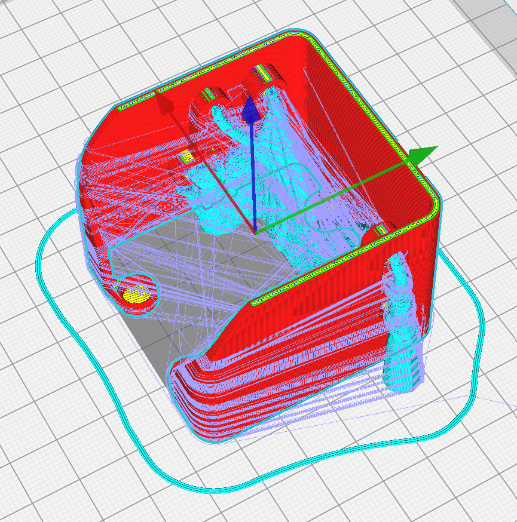
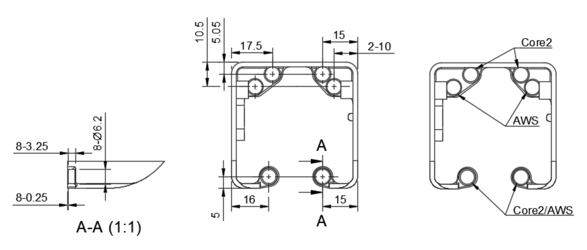
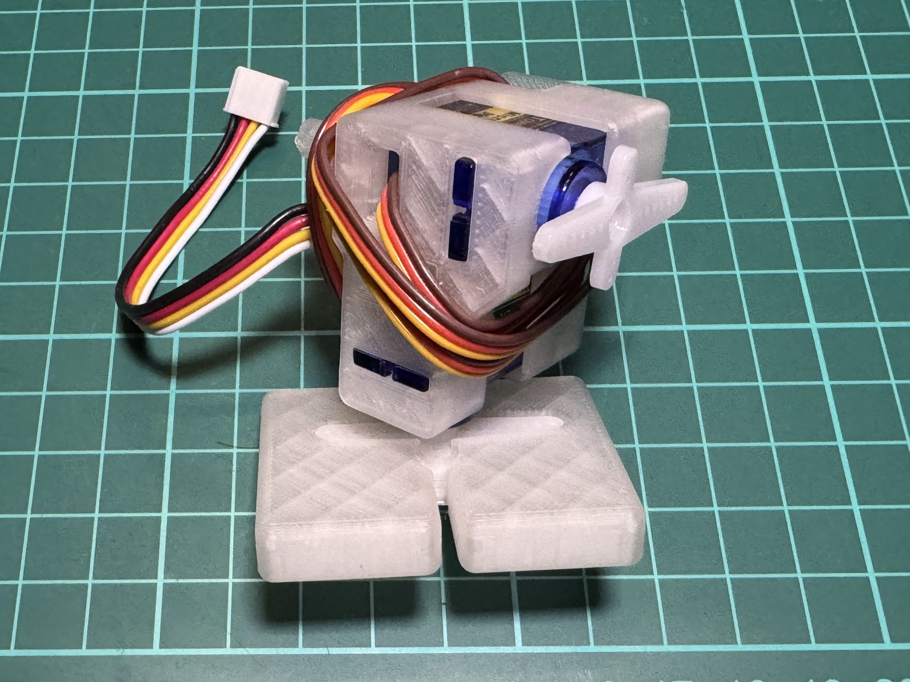
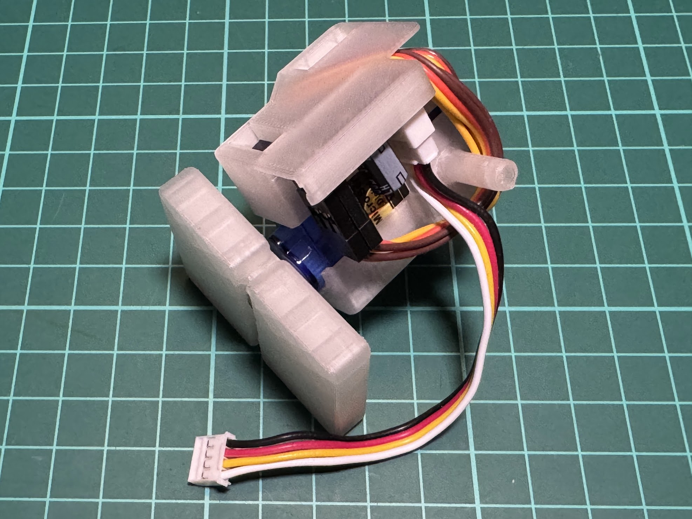
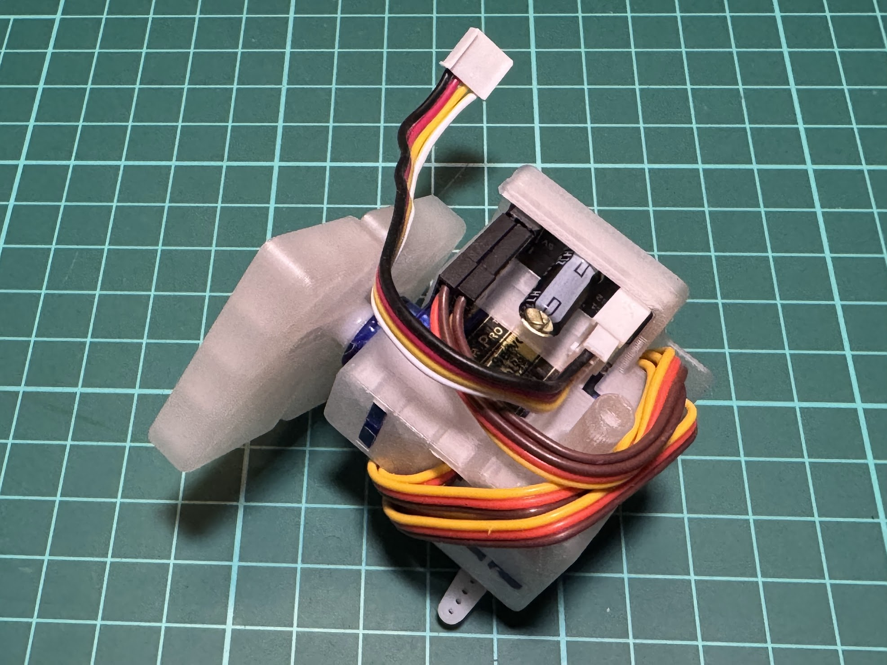

# Stack-chan shell model for Core2/AWS and SG90 Magnetic Case feature
日本語 | [English](./README_for_Magnetic_Case_Core2_AWS_SG90.md)

# 注意事項
本モデルはM5Stack Core2/AWSとSG90サーボモーターの組み合わせで動作確認を行いました。異なる種類のM5Stackとは互換性が無い可能性があります。シェルの造形前にご確認をお願いします。
本モデルを使用するにあたり、M5Stackを分解する必要はありません。

# 外観
旧版から見た見た目は変わっていません。ブラケットの構造を見直し、以下の変更を盛り込みました。
1. ブラケットの構造を見直し、サーボの配線を固定できるようにしました。
2. サーボ基板を取り付け可能な構造にしました。（後述）
3. マグネットスロット寸法をBambu P1Sに最適化しました。

# 造形手順
シェルはM5Stackを取り付ける側を下にし、ツリー形状サポートの使用を推奨します。

# 組立手順
直径6mm、厚さ2.5mmのマグネットを、4箇所のマグネットスロットに挿入して下さい。マグネットは百均ショップで購入できます。また、取付前にマグネットの極性を確認願います。マグネットの挿入位置は下図を参照して下さい。 

サーボのケーブルは以下の図を参考にフォーミングして下さい。ケーブル長の調整は不要です。

サーボの配線は孔明さん設計の[Grove PORTサーボ接続基板キット](https://b-sky-lab.booth.pm/items/5194419)を使用します。
[Grove PORTサーボ接続基板キット (GitHub)](https://github.com/kim-xps12/m5stack_board_grove_port_servo)

その他M5Stackとの配線に[Unbuckled Grove Cable 10cm](https://www.switch-science.com/catalog/grove-cable-10cm-10-pack/)が必要です。
 