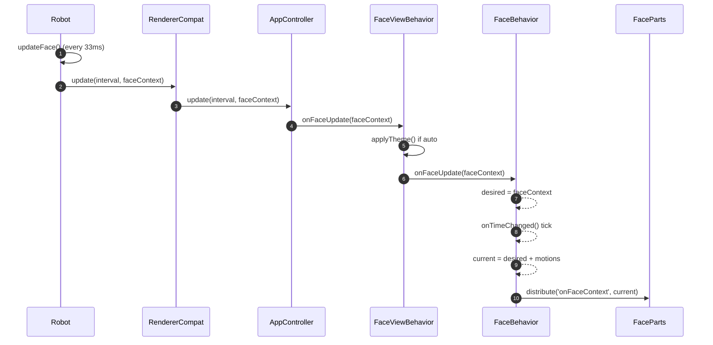
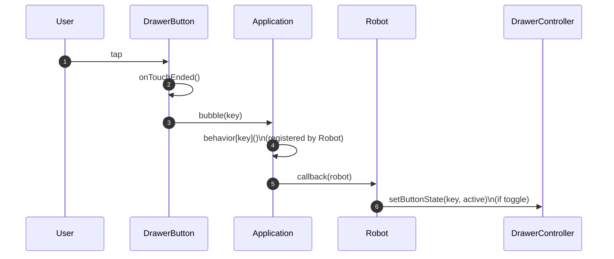

# Piu Renderer (Implementation Reference)

This document consolidates the prior PIU renderer notes and reflects the **current implementation** as the source of truth.
All file paths below are relative to `firmware/` unless otherwise noted.

## 1. Entry Points and High-Level Architecture

### Renderer entrypoints (current)
- `stackchan/renderers-piu/renderer-simple.ts`
- `stackchan/renderers-piu/renderer-dog.ts`
- `stackchan/renderers-piu/renderer-small.ts`

Each entrypoint creates a Piu `Application` with `AppController` as its `Behavior` and returns the behavior instance.
A legacy adapter `RendererCompat` wraps `AppController` to keep the old `Renderer` API shape used by `Robot`.

## 2. FaceContext Structure

Defined in `stackchan/renderers-piu/face-context.ts`.

```ts
type FaceContext = {
  mouth: { open: number }
  eyes: {
    left: { open: number; gazeX: number; gazeY: number }
    right: { open: number; gazeX: number; gazeY: number }
  }
  breath: number
  emotion: 'NEUTRAL' | 'ANGRY' | 'SAD' | 'HAPPY' | 'SLEEPY' | 'DOUBTFUL' | 'COLD' | 'HOT'
  theme: {
    primary: string
    secondary: string
  }
}
```

Notes:
- `theme.primary` and `theme.secondary` are hex color strings (e.g. `#ffffff`).
- `defaultFaceContext`, `createFaceContext`, and `copyFaceContext` are provided in the same file.

## 3. UI Component Hierarchy (current)

```
Application (Behavior: AppController)
└─ FaceView (CommonView template)
   ├─ Main (FaceMainTemplate)
   │  ├─ Face (FaceBase -> SimpleFace / DogFace / SmallFace)
   │  │  ├─ Eye (includes Eyelid, Iris)
   │  │  └─ Mouth
   │  │  └─ Dog parts (eyebrow / nose / mouth) [DogFace only]
   │  └─ Effects container
   │     ├─ SpeechBalloon
   │     └─ Emoticon (heart / angry / sweat / tear / sleepy)
   ├─ AppBar (Content; height 0 by default)
   └─ Overlay (Container)
      └─ Drawer (Container)
         └─ Scroller -> Column -> DrawerButton*
```

## 4. UI Components: Roles and Template Arguments

### 4.1 Application + AppController (`renderers-piu/app-controller.ts`)
**Role:** The top-level behavior that builds and manages the view, forwards face updates, and provides drawer/effect helpers.

**Construction (current entrypoints):**
```ts
new Application(
  { face: new SimpleFace(), drawerButtons?: DrawerButtonSpec[] },
  { displayListLength: 2048, contents: [], Behavior: AppController }
)
```

**Initialization parameters (AppControllerParams = FaceViewParams):**
| Name | Type | Required | Description |
| --- | --- | --- | --- |
| `face` | `PiuContainer` | Required if `main` is omitted | Face container instance. |
| `main` | `PiuContainer` | Optional | Root container if you build it yourself. |
| `effects` | `PiuContainer` | Optional | Effects container (auto-created if omitted). |
| `skin` | `PiuSkin` | Optional | Background skin. Omit to enable theme auto-sync. |
| `drawerButtons` | `DrawerButtonSpec[]` | Optional | Initial Drawer buttons. |

**Public methods (Behavior):**
| Method | Description |
| --- | --- |
| `update(interval, faceContext)` | Apply face update to the view. |
| `addEffect(effect, key?)` | Add a Piu content to the effects container (optional key). |
| `removeEffect(effect)` | Remove a Piu content from the effects container. |
| `removeEffectByKey(key)` | Remove an effect by key (uses `name` when available). |
| `setFace(face)` | Replace the active face container. |
| `setDrawerButtons(buttons)` | Replace all drawer buttons. |
| `addDrawerButton(button)` | Add or replace a drawer button by key. |
| `removeDrawerButton(key)` | Remove a drawer button. |
| `setDrawerButtonState(key, active)` | Update toggle state. |
| `openDrawer()` | Open the drawer. |
| `closeDrawer()` | Close the drawer. |
| `toggleDrawer()` | Toggle drawer open/close. |

**Attached controllers on Application:**
| Name | Description |
| --- | --- |
| `application.drawerController` | Drawer button registry for `Robot` helpers. |

### 4.2 CommonView (`renderers-piu/common-view.ts`)
**Role:** Base layout that hosts Main + AppBar + Overlay, and owns Drawer state via `CommonViewBehavior`.

**Template params (CommonViewParams):**
| Name | Type | Required | Description |
| --- | --- | --- | --- |
| `MAIN` | `PiuContainer` | Required | Anchor for main content. |
| `APP_BAR` | `PiuContent` | Required | Anchor for app bar content. |
| `OVERLAY` | `PiuContainer` | Required | Anchor for overlay layer. |
| `main` | `PiuContainer` | Optional | Convenience alias for `MAIN`. |
| `drawerButtons` | `DrawerButtonSpec[]` | Optional | Initial Drawer buttons. |

**Public methods (CommonViewBehavior):**
| Method | Description |
| --- | --- |
| `openDrawer()` | Open the drawer and enable overlay. |
| `closeDrawer()` | Close the drawer and disable overlay. |
| `toggleDrawer()` | Toggle drawer open/close. |
| `setDrawerButtons(buttons)` | Replace all drawer buttons. |
| `addDrawerButton(button)` | Add or replace a drawer button by key. |
| `removeDrawerButton(key)` | Remove a drawer button. |
| `setDrawerButtonState(key, active)` | Update toggle state. |

**Behavior notes:**
| Item | Description |
| --- | --- |
| Drawer creation | `new Drawer({ buttons })` |
| Overlay close | Overlay `onTouchEnded` bubbles `onDrawerClose`. |

### 4.3 FaceView (`renderers-piu/face-view.ts`)
**Role:** CommonView specialization for face rendering. Adds theme sync, face update dispatch, and effect container control.

**Template params (FaceViewParams):**
| Name | Type | Required | Description |
| --- | --- | --- | --- |
| `face` | `PiuContainer` | Required if `main` is omitted | Face container instance. |
| `effects` | `PiuContainer` | Optional | Effects container (auto-created if omitted). |
| `skin` | `PiuSkin` | Optional | Background skin. Omit to enable theme auto-sync. |
| `FACE` | `PiuContainer` | Required if `main` is provided | Anchor for face container. |
| `EFFECTS` | `PiuContainer` | Required if `main` is provided | Anchor for effects container. |
| (inherits) | `CommonViewParams` | — | `MAIN`, `APP_BAR`, `OVERLAY`, `drawerButtons`. |

**Public methods (FaceViewBehavior):**
| Method | Description |
| --- | --- |
| `onFaceUpdate(faceContext)` | Apply theme and forward to face container behavior. |
| `onFaceContext(faceContext)` | Forward to effects, overlay, and app bar when invoked. |
| `addEffect(effect, key?)` | Add effect content to the effects container (optional key). |
| `removeEffect(effect)` | Remove effect content from the effects container. |
| `removeEffectByKey(key)` | Remove effect content by key (uses `name` when available). |
| `setFace(face)` | Swap the face container inside Main. |

### 4.4 FaceMainTemplate (`renderers-piu/face-view.ts`)
**Role:** Full-screen container holding face + effects, with a background skin.

**Params (uses FaceViewParams):**
| Name | Type | Required | Description |
| --- | --- | --- | --- |
| `face` | `PiuContainer` | Required | Face container instance. |
| `effects` | `PiuContainer` | Optional | Effects container (auto-created if omitted). |
| `skin` | `PiuSkin` | Optional | Background skin (defaults to theme secondary). |

### 4.5 FaceBase and Face Templates (`renderers-piu/behaviors/face.ts`)

#### FaceBase
**Role:** Base face container with `FaceBehavior` and a configurable content list.

**Params (FaceBaseParams):**
| Name | Type | Required | Description |
| --- | --- | --- | --- |
| `contents` | `PiuContent[]` | Optional | Face part instances. |
| `motions` | `FaceMotion[]` | Optional | Motion functions applied each tick. |
| `intervalMs` | `number` | Optional | Tick interval (default 33ms). |
| `left/right/top/bottom/width/height` | `number` | Optional | Face container layout. |

#### FaceBehavior
**Role:** Owns `current` and `desired` `FaceContext`, applies motions, breath offset, and dispatches `onFaceContext` to descendants.

**Defaults:**
| Item | Value |
| --- | --- |
| `intervalMs` | `33` |
| Motions | `createBlinkMotion` + `createBreathMotion` (saccade is available but not enabled by default) |
| Breath offset | `container.top = baseTop + breath * 6` |

**Public methods (FaceBehavior):**
| Method | Description |
| --- | --- |
| `onFaceUpdate(faceContext)` | Copy to desired context (invoked by FaceView/AppController). |
| `pause()` | Stop updates and hide the face container. |
| `resume()` | Resume updates and show the face container. |

#### Face Templates
- `SimpleFace`: `Eye` x2 + `Mouth`
- `SmallFace`: smaller eye/mouth layout
- `DogFace`: eyes + eyebrows + dog mouth + dog nose

Each template is a `FaceBase` specialization and accepts `FaceBaseParams` (size/position overrides, motions, interval).

**Initialization params (Face Templates):**
| Template | Params | Description |
| --- | --- | --- |
| `SimpleFace` | `FaceBaseParams` | Standard face layout. |
| `SmallFace` | `FaceBaseParams` | Compact face layout. |
| `DogFace` | `FaceBaseParams` | Dog face layout. |

### 4.6 Face Parts

#### Eye (`parts/eye.ts`)
**Role:** Iris + eyelid. Updates iris position from gaze and eyelid shape from emotion/open.

**Params (EyeOptions):**
| Name | Type | Required | Description |
| --- | --- | --- | --- |
| `cx`, `cy` | `number` | Required | Center position in face coordinates. |
| `radius` | `number` | Optional | Iris radius. |
| `side` | `'left' | 'right'` | Required | Eye side. |
| `eyelidWidth`, `eyelidHeight` | `number` | Optional | Eyelid bounds. |

#### Eyelid (`parts/eye.ts`)
**Role:** Emotion-aware eyelid shape.

**Params (EyelidOptions):**
| Name | Type | Required | Description |
| --- | --- | --- | --- |
| `cx`, `cy` | `number` | Required | Center position. |
| `width`, `height` | `number` | Required | Eyelid bounds. |
| `side` | `'left' | 'right'` | Required | Eye side. |

#### Mouth (`parts/mouth.ts`)
**Role:** Rectangle mouth shape that grows/shrinks with `mouth.open`.

**Params (MouthOptions):**
| Name | Type | Required | Description |
| --- | --- | --- | --- |
| `cx`, `cy` | `number` | Required | Center position. |
| `minWidth`, `maxWidth` | `number` | Optional | Width range. |
| `minHeight`, `maxHeight` | `number` | Optional | Height range. |

#### Dog parts (`parts/dog/*.ts`)
**DogEyebrow (EyebrowOptions):**
| Name | Type | Required | Description |
| --- | --- | --- | --- |
| `cx`, `cy` | `number` | Required | Center position. |
| `side` | `'left' | 'right'` | Required | Eye side. |
| `canvasWidth`, `canvasHeight` | `number` | Optional | Canvas size used for outline. |

**DogMouth (DogMouthOptions):**
| Name | Type | Required | Description |
| --- | --- | --- | --- |
| `cx`, `cy` | `number` | Required | Center position. |
| `minWidth`, `maxWidth` | `number` | Optional | Width range. |
| `minHeight`, `maxHeight` | `number` | Optional | Height range. |
| `canvasWidth`, `canvasHeight` | `number` | Optional | Canvas size used for outline. |

**DogNose (DogNoseOptions):**
| Name | Type | Required | Description |
| --- | --- | --- | --- |
| `cx`, `cy` | `number` | Required | Center position. |
| `minHeight`, `maxHeight` | `number` | Optional | Height range. |
| `canvasWidth`, `canvasHeight` | `number` | Optional | Canvas size used for outline. |

### 4.7 Effects

#### Speech Balloon (`effects/speech-balloon.ts`)
**Template:** `SpeechBalloon`

**Options (SpeechBalloonOptions):**
| Name | Type | Required | Description |
| --- | --- | --- | --- |
| `name` | `string` | Optional | Optional key for effect management. |
| `left/right/top/bottom/width/height` | `number` | Optional | Layout bounds. |
| `padding` | `number` | Optional | Inner padding. |
| `space` | `number` | Optional | Gap between repeated text. |
| `radius` | `number` | Optional | Corner radius. |
| `text` | `string` | Optional | Text content. |
| `font` | `string` | Optional | Font string. |
| `speed` | `number` | Optional | Scroll speed. |

#### Emoticon (`effects/emoticon.ts`)
**Template:** `Emoticon`

**Params (EmoticonParams):**
| Name | Type | Required | Description |
| --- | --- | --- | --- |
| `key` | `'heart' | 'angry' | 'sweat' | 'tear' | 'sleepy'` | Required | Emoticon type. |
| `name` | `string` | Optional | Optional key for effect management. |
| `left/right/top/bottom/width/height` | `number` | Optional | Layout bounds. |
| `angle` | `number` | Optional | Rotation angle. |
| `interval` | `number` | Optional | Tick interval. |
| `count` | `number` | Optional | Particle count (sweat/tear). |
| `lanes` | `[number, number][]` | Optional | Spawn lanes (tear). |
| `smallScale` | `number` | Optional | Min scale (sweat). |
| `holdScale` | `number` | Optional | Hold scale (sweat). |

### 4.8 Drawer (`renderers-piu/drawer.ts`)

**Template:** `Drawer`

**Template params:**
| Name | Type | Required | Description |
| --- | --- | --- | --- |
| `buttons` | `DrawerButtonSpec[]` | Optional | Initial buttons. |

**DrawerButtonSpec:**
| Name | Type | Required | Description |
| --- | --- | --- | --- |
| `key` | `string` | Required | Event key used for `bubble`. |
| `label` | `string` | Required | Button label. |
| `kind` | `'action' | 'toggle'` | Optional | Toggle buttons show an indicator. |
| `active` | `boolean` | Optional | Initial toggle state. |

**Public methods (DrawerBehavior):**
| Method | Description |
| --- | --- |
| `setOpen(container, open)` | Open/close with animation. |
| `toggle(container)` | Toggle open/close. |
| `setButtonState(container, key, active)` | Update toggle indicator if button exists. |

### 4.9 Motions (`renderers-piu/motions/*`)
**Types and factories:**
| Name | Signature | Description |
| --- | --- | --- |
| `FaceMotion` | `(tickMillis: number, face: FaceContext) => void` | Motion function applied each tick. |
| `createBlinkMotion` | `(options) => FaceMotion` | Randomized blink motion. |
| `createBreathMotion` | `(options) => FaceMotion` | Sinusoidal breath motion. |
| `createSaccadeMotion` | `(options) => FaceMotion` | Random gaze saccade motion. |

## 5. Usage Examples

### 5.1 Instantiate and set Face
```ts
import { createRenderer } from 'renderer-simple'
import { DogFace } from 'behaviors/face'

const controller = createRenderer()
const dogFace = new DogFace({})

controller.setFace(dogFace)
```

### 5.2 Instantiate and add/remove Emoticon / SpeechBalloon
```ts
import { createRenderer } from 'renderer-simple'
import { Emoticon } from 'effects/emoticon'
import { SpeechBalloon } from 'effects/speech-balloon'

const controller = createRenderer()

const heart = new Emoticon({ key: 'heart', left: 8, top: 8 })
const speech = new SpeechBalloon({ text: 'Hello from Stack-chan' })

controller.addEffect(heart)
controller.addEffect(speech)

controller.removeEffect(heart)
controller.removeEffect(speech)
```

## 6. Sequence: FaceContext Update -> Rendering Update



Note: `FaceViewBehavior.onFaceUpdate` calls `onFaceContext` to propagate theme updates to effects/overlay. `FaceBehavior` does not bubble `onFaceContext` to the view by default.

## 7. Sequence: Drawer Button Touch -> Handler Execution



In the PIU test app, handlers are attached directly on the `AppController` instance by assigning methods with matching names.

## 7. Key Files (for navigation)
- `stackchan/renderers-piu/app-controller.ts`
- `stackchan/renderers-piu/face-view.ts`
- `stackchan/renderers-piu/common-view.ts`
- `stackchan/renderers-piu/behaviors/face.ts`
- `stackchan/renderers-piu/drawer.ts`
- `stackchan/renderers-piu/effects/*`
- `stackchan/renderers-piu/parts/*`
- `stackchan/robot.ts`
