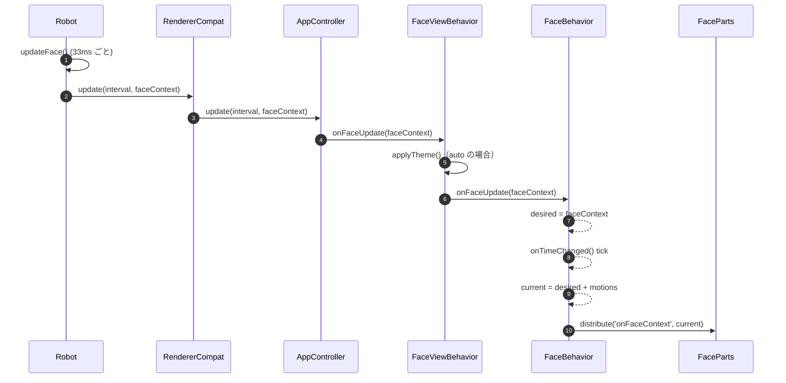
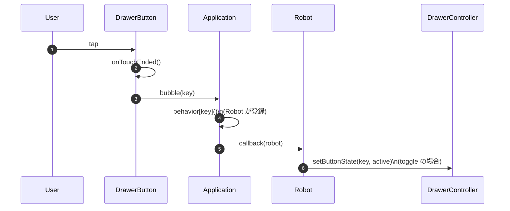

# Piu Renderer（実装リファレンス）

本ドキュメントは PIU Renderer に関する既存メモを統合し、**現在の実装**を真としてまとめたものです。
以下のパスは特記がない限り `firmware/` からの相対パスです。

## 1. エントリポイントと全体構成

### Renderer のエントリポイント（現行）
- `stackchan/renderers-piu/renderer-simple.ts`
- `stackchan/renderers-piu/renderer-dog.ts`
- `stackchan/renderers-piu/renderer-small.ts`

各エントリポイントは、`AppController` を `Behavior` に持つ Piu `Application` を生成し、
その `behavior` を返します。
旧 API 互換の `RendererCompat` が `AppController` をラップし、`Robot` が期待する `Renderer` 形状を維持しています。

## 2. FaceContext の構成

`stackchan/renderers-piu/face-context.ts` で定義されています。

```ts
type FaceContext = {
  mouth: { open: number }
  eyes: {
    left: { open: number; gazeX: number; gazeY: number }
    right: { open: number; gazeX: number; gazeY: number }
  }
  breath: number
  emotion: 'NEUTRAL' | 'ANGRY' | 'SAD' | 'HAPPY' | 'SLEEPY' | 'DOUBTFUL' | 'COLD' | 'HOT'
  theme: {
    primary: string
    secondary: string
  }
}
```

補足:
- `theme.primary` / `theme.secondary` は hex 文字列（例: `#ffffff`）。
- `defaultFaceContext` / `createFaceContext` / `copyFaceContext` が同ファイルにあります。

## 3. UI コンポーネント階層（現行）

```
Application (Behavior: AppController)
└─ FaceView (CommonView template)
   ├─ Main (FaceMainTemplate)
   │  ├─ Face (FaceBase -> SimpleFace / DogFace / SmallFace)
   │  │  ├─ Eye (Eyelid, Iris を含む)
   │  │  └─ Mouth
   │  │  └─ Dog parts (eyebrow / nose / mouth) [DogFace のみ]
   │  └─ Effects container
   │     ├─ SpeechBalloon
   │     └─ Emoticon (heart / angry / sweat / tear / sleepy)
   ├─ AppBar (Content; 既定では高さ 0)
   └─ Overlay (Container)
      └─ Drawer (Container)
         └─ Scroller -> Column -> DrawerButton*
```

## 4. UI コンポーネントの役割とテンプレート引数

### 4.1 Application + AppController（`renderers-piu/app-controller.ts`）
**役割:** View の構築と管理、顔更新の伝播、Drawer/Effect 操作の仲介。

**生成（現行エントリポイント）:**
```ts
new Application(
  { face: new SimpleFace(), drawerButtons?: DrawerButtonSpec[] },
  { displayListLength: 2048, contents: [], Behavior: AppController }
)
```

**初期化引数（AppControllerParams = FaceViewParams）:**
| 名称 | 型 | 必須 | 説明 |
| --- | --- | --- | --- |
| `face` | `PiuContainer` | `main` が無い場合は必須 | Face コンテナ。 |
| `main` | `PiuContainer` | 任意 | 自前で root を作る場合。 |
| `effects` | `PiuContainer` | 任意 | Effects コンテナ（省略時は自動生成）。 |
| `skin` | `PiuSkin` | 任意 | 背景スキン。省略時はテーマ自動同期。 |
| `drawerButtons` | `DrawerButtonSpec[]` | 任意 | 初期 Drawer ボタン。 |

**パフォーマンス上の注意:**
- Renderer の各エントリポイントは `displayListLength` の既定値として `2048` を使います。
- より大きな display list が必要な UI の場合だけ renderer 設定から上書きし、全デバイス向けの固定値をむやみに増やさない方針にします。

**公開メソッド（Behavior）:**
| メソッド | 説明 |
| --- | --- |
| `update(interval, faceContext)` | 顔更新をビューに反映。 |
| `addEffect(effect, key?)` | Effects に PiuContent を追加（任意キー）。 |
| `removeEffect(effect)` | Effects から PiuContent を削除。 |
| `removeEffectByKey(key)` | キー指定で削除（`name` を利用）。 |
| `setFace(face)` | Face コンテナを差し替え。 |
| `setDrawerButtons(buttons)` | Drawer ボタンを全置換。 |
| `addDrawerButton(button)` | Drawer ボタンを追加/差し替え。 |
| `removeDrawerButton(key)` | Drawer ボタンを削除。 |
| `setDrawerButtonState(key, active)` | トグル状態を更新。 |
| `openDrawer()` | Drawer を開く。 |
| `closeDrawer()` | Drawer を閉じる。 |
| `toggleDrawer()` | Drawer をトグル。 |

**Application へ付与される controller:**
| 名称 | 説明 |
| --- | --- |
| `application.drawerController` | Drawer ボタン操作用。 |

### 4.2 CommonView（`renderers-piu/common-view.ts`）
**役割:** Main + AppBar + Overlay を配置し、Drawer 状態を `CommonViewBehavior` で管理。

**テンプレート引数（CommonViewParams）:**
| 名称 | 型 | 必須 | 説明 |
| --- | --- | --- | --- |
| `MAIN` | `PiuContainer` | 必須 | Main のアンカー。 |
| `APP_BAR` | `PiuContent` | 必須 | AppBar のアンカー。 |
| `OVERLAY` | `PiuContainer` | 必須 | Overlay のアンカー。 |
| `main` | `PiuContainer` | 任意 | `MAIN` の省略指定。 |
| `drawerButtons` | `DrawerButtonSpec[]` | 任意 | 初期 Drawer ボタン。 |

**公開メソッド（CommonViewBehavior）:**
| メソッド | 説明 |
| --- | --- |
| `openDrawer()` | Drawer を開き、Overlay を有効化。 |
| `closeDrawer()` | Drawer を閉じ、Overlay を無効化。 |
| `toggleDrawer()` | Drawer をトグル。 |
| `setDrawerButtons(buttons)` | Drawer ボタンを全置換。 |
| `addDrawerButton(button)` | Drawer ボタンを追加/差し替え。 |
| `removeDrawerButton(key)` | Drawer ボタンを削除。 |
| `setDrawerButtonState(key, active)` | トグル状態を更新。 |

**Behavior の補足:**
| 項目 | 説明 |
| --- | --- |
| Drawer 生成 | `new Drawer({ buttons })` |
| Overlay 終了 | Overlay の `onTouchEnded` が `onDrawerClose` を bubble。 |

### 4.3 FaceView（`renderers-piu/face-view.ts`）
**役割:** CommonView を顔描画用に拡張。テーマ同期、顔更新の配布、Effect 管理を追加。

**テンプレート引数（FaceViewParams）:**
| 名称 | 型 | 必須 | 説明 |
| --- | --- | --- | --- |
| `face` | `PiuContainer` | `main` が無い場合は必須 | Face コンテナ。 |
| `effects` | `PiuContainer` | 任意 | Effects コンテナ（省略時は自動生成）。 |
| `skin` | `PiuSkin` | 任意 | 背景スキン。省略時はテーマ自動同期。 |
| `FACE` | `PiuContainer` | `main` 指定時は必須 | Face のアンカー。 |
| `EFFECTS` | `PiuContainer` | `main` 指定時は必須 | Effects のアンカー。 |
|（継承）| `CommonViewParams` | — | `MAIN`, `APP_BAR`, `OVERLAY`, `drawerButtons`。 |

**公開メソッド（FaceViewBehavior）:**
| メソッド | 説明 |
| --- | --- |
| `onFaceUpdate(faceContext)` | テーマ反映と face container への転送。 |
| `onFaceContext(faceContext)` | effects / overlay / app bar へ配布。 |
| `addEffect(effect, key?)` | Effects に追加（任意キー）。 |
| `removeEffect(effect)` | Effects から削除。 |
| `removeEffectByKey(key)` | キー指定で削除（`name` を利用）。 |
| `setFace(face)` | Face コンテナを差し替え。 |

### 4.4 FaceMainTemplate（`renderers-piu/face-view.ts`）
**役割:** Face + Effects を持つ全画面コンテナ（背景スキン付き）。

**引数（FaceViewParams を利用）:**
| 名称 | 型 | 必須 | 説明 |
| --- | --- | --- | --- |
| `face` | `PiuContainer` | 必須 | Face コンテナ。 |
| `effects` | `PiuContainer` | 任意 | Effects コンテナ（省略時は自動生成）。 |
| `skin` | `PiuSkin` | 任意 | 背景スキン（省略時は theme.secondary）。 |

### 4.5 FaceBase と Face テンプレート（`renderers-piu/behaviors/face.ts`）

#### FaceBase
**役割:** `FaceBehavior` を持つベース顔コンテナ。`contents` で構成部品を渡す。

**引数（FaceBaseParams）:**
| 名称 | 型 | 必須 | 説明 |
| --- | --- | --- | --- |
| `contents` | `PiuContent[]` | 任意 | Face パーツのインスタンス。 |
| `motions` | `FaceMotion[]` | 任意 | tick ごとに適用するモーション。 |
| `intervalMs` | `number` | 任意 | tick 間隔（既定 33ms）。 |
| `left/right/top/bottom/width/height` | `number` | 任意 | Face コンテナのレイアウト。 |

#### FaceBehavior
**役割:** `current` / `desired` の FaceContext を保持し、モーション適用・呼吸オフセット・`onFaceContext` 配布を担当。

**既定値:**
| 項目 | 値 |
| --- | --- |
| `intervalMs` | `33` |
| モーション | `createBlinkMotion` + `createBreathMotion`（saccade は既定で無効） |
| 呼吸オフセット | `container.top = baseTop + breath * 6` |

**公開メソッド（FaceBehavior）:**
| メソッド | 説明 |
| --- | --- |
| `onFaceUpdate(faceContext)` | desired へコピー（FaceView/AppController から呼ばれる）。 |
| `pause()` | 更新停止＋非表示化。 |
| `resume()` | 更新再開＋表示化。 |

#### Face テンプレート
- `SimpleFace`: `Eye` x2 + `Mouth`
- `SmallFace`: 小さめの目/口レイアウト
- `DogFace`: 目 + 眉 + 犬口 + 犬鼻

各テンプレートは `FaceBase` の派生で、`FaceBaseParams`（位置・サイズ・モーション・interval）を受け取れます。

**初期化引数（Face テンプレート）:**
| テンプレート | 引数 | 説明 |
| --- | --- | --- |
| `SimpleFace` | `FaceBaseParams` | 標準レイアウト。 |
| `SmallFace` | `FaceBaseParams` | コンパクトレイアウト。 |
| `DogFace` | `FaceBaseParams` | 犬顔レイアウト。 |

### 4.6 Face パーツ

#### Eye（`parts/eye.ts`）
**役割:** 虹彩 + まぶた。視線に応じて虹彩位置、感情/開閉でまぶた形状を更新。

**引数（EyeOptions）:**
| 名称 | 型 | 必須 | 説明 |
| --- | --- | --- | --- |
| `cx`, `cy` | `number` | 必須 | 中心座標。 |
| `radius` | `number` | 任意 | 虹彩の半径。 |
| `side` | `'left' | 'right'` | 必須 | 目の左右。 |
| `eyelidWidth`, `eyelidHeight` | `number` | 任意 | まぶたのサイズ。 |

#### Eyelid（`parts/eye.ts`）
**役割:** 感情に応じたまぶた形状。

**引数（EyelidOptions）:**
| 名称 | 型 | 必須 | 説明 |
| --- | --- | --- | --- |
| `cx`, `cy` | `number` | 必須 | 中心座標。 |
| `width`, `height` | `number` | 必須 | まぶたのサイズ。 |
| `side` | `'left' | 'right'` | 必須 | 目の左右。 |

#### Mouth（`parts/mouth.ts`）
**役割:** `mouth.open` に応じて拡縮する矩形の口。

**引数（MouthOptions）:**
| 名称 | 型 | 必須 | 説明 |
| --- | --- | --- | --- |
| `cx`, `cy` | `number` | 必須 | 中心座標。 |
| `minWidth`, `maxWidth` | `number` | 任意 | 幅の範囲。 |
| `minHeight`, `maxHeight` | `number` | 任意 | 高さの範囲。 |

#### Dog パーツ（`parts/dog/*.ts`）
**DogEyebrow（EyebrowOptions）:**
| 名称 | 型 | 必須 | 説明 |
| --- | --- | --- | --- |
| `cx`, `cy` | `number` | 必須 | 中心座標。 |
| `side` | `'left' | 'right'` | 必須 | 目の左右。 |
| `canvasWidth`, `canvasHeight` | `number` | 任意 | Outline 用キャンバスサイズ。 |

**DogMouth（DogMouthOptions）:**
| 名称 | 型 | 必須 | 説明 |
| --- | --- | --- | --- |
| `cx`, `cy` | `number` | 必須 | 中心座標。 |
| `minWidth`, `maxWidth` | `number` | 任意 | 幅の範囲。 |
| `minHeight`, `maxHeight` | `number` | 任意 | 高さの範囲。 |
| `canvasWidth`, `canvasHeight` | `number` | 任意 | Outline 用キャンバスサイズ。 |

**DogNose（DogNoseOptions）:**
| 名称 | 型 | 必須 | 説明 |
| --- | --- | --- | --- |
| `cx`, `cy` | `number` | 必須 | 中心座標。 |
| `minHeight`, `maxHeight` | `number` | 任意 | 高さの範囲。 |
| `canvasWidth`, `canvasHeight` | `number` | 任意 | Outline 用キャンバスサイズ。 |

### 4.7 Effects

#### Speech Balloon（`effects/speech-balloon.ts`）
**Template:** `SpeechBalloon`

**Options（SpeechBalloonOptions）:**
| 名称 | 型 | 必須 | 説明 |
| --- | --- | --- | --- |
| `name` | `string` | 任意 | Effect 管理用のキー。 |
| `left/right/top/bottom/width/height` | `number` | 任意 | レイアウト指定。 |
| `padding` | `number` | 任意 | 内側余白。 |
| `space` | `number` | 任意 | 繰り返し文字列の間隔。 |
| `radius` | `number` | 任意 | 角丸半径。 |
| `text` | `string` | 任意 | 表示文字列。 |
| `font` | `string` | 任意 | フォント指定。 |
| `speed` | `number` | 任意 | スクロール速度。 |

#### Emoticon（`effects/emoticon.ts`）
**Template:** `Emoticon`

**Params（EmoticonParams）:**
| 名称 | 型 | 必須 | 説明 |
| --- | --- | --- | --- |
| `key` | `'heart' | 'angry' | 'sweat' | 'tear' | 'sleepy'` | 必須 | 感情種別。 |
| `name` | `string` | 任意 | Effect 管理用のキー。 |
| `left/right/top/bottom/width/height` | `number` | 任意 | レイアウト指定。 |
| `angle` | `number` | 任意 | 回転角。 |
| `interval` | `number` | 任意 | tick 間隔。 |
| `count` | `number` | 任意 | 粒数（sweat/tear）。 |
| `lanes` | `[number, number][]` | 任意 | レーン指定（tear）。 |
| `smallScale` | `number` | 任意 | 最小スケール（sweat）。 |
| `holdScale` | `number` | 任意 | 保持スケール（sweat）。 |

### 4.8 Drawer（`renderers-piu/drawer.ts`）

**Template:** `Drawer`

**テンプレート引数:**
| 名称 | 型 | 必須 | 説明 |
| --- | --- | --- | --- |
| `buttons` | `DrawerButtonSpec[]` | 任意 | 初期ボタン。 |

**DrawerButtonSpec:**
| 名称 | 型 | 必須 | 説明 |
| --- | --- | --- | --- |
| `key` | `string` | 必須 | `bubble` に使うイベントキー。 |
| `label` | `string` | 必須 | ボタン表示。 |
| `kind` | `'action' | 'toggle'` | 任意 | toggle はインジケータを表示。 |
| `active` | `boolean` | 任意 | 初期トグル状態。 |

**公開メソッド（DrawerBehavior）:**
| メソッド | 説明 |
| --- | --- |
| `setOpen(container, open)` | 開閉アニメーション。 |
| `toggle(container)` | 開閉をトグル。 |
| `setButtonState(container, key, active)` | トグル表示を更新。 |

### 4.9 Motions（`renderers-piu/motions/*`）
**型とファクトリ:**
| 名称 | シグネチャ | 説明 |
| --- | --- | --- |
| `FaceMotion` | `(tickMillis: number, face: FaceContext) => void` | tick ごとに適用される関数。 |
| `createBlinkMotion` | `(options) => FaceMotion` | まばたきモーション。 |
| `createBreathMotion` | `(options) => FaceMotion` | 呼吸モーション。 |
| `createSaccadeMotion` | `(options) => FaceMotion` | 視線サッケード。 |

## 5. 利用例

### 5.1 Face の生成と set
```ts
import { createRenderer } from 'renderer-simple'
import { DogFace } from 'behaviors/face'

const controller = createRenderer()
const dogFace = new DogFace({})

controller.setFace(dogFace)
```

### 5.2 Emoticon / SpeechBalloon の生成と add/remove
```ts
import { createRenderer } from 'renderer-simple'
import { Emoticon } from 'effects/emoticon'
import { SpeechBalloon } from 'effects/speech-balloon'

const controller = createRenderer()

const heart = new Emoticon({ key: 'heart', left: 8, top: 8 })
const speech = new SpeechBalloon({ text: 'Hello from Stack-chan' })

controller.addEffect(heart)
controller.addEffect(speech)

controller.removeEffect(heart)
controller.removeEffect(speech)
```

## 6. FaceContext 更新 → 描画更新のシーケンス



補足: `FaceViewBehavior.onFaceUpdate` から `onFaceContext` を呼び、effects/overlay のテーマ更新を伝播します。
`FaceBehavior` からは既定で view へ bubble していません。

## 7. Drawer ボタンタッチ → ハンドラ実行のシーケンス



PIU テストアプリでも同様に、`AppController` にメソッドを割り当てる形でハンドラを登録しています。

## 7. 主要ファイル（参照用）
- `stackchan/renderers-piu/app-controller.ts`
- `stackchan/renderers-piu/face-view.ts`
- `stackchan/renderers-piu/common-view.ts`
- `stackchan/renderers-piu/behaviors/face.ts`
- `stackchan/renderers-piu/drawer.ts`
- `stackchan/renderers-piu/effects/*`
- `stackchan/renderers-piu/parts/*`
- `stackchan/robot.ts`
