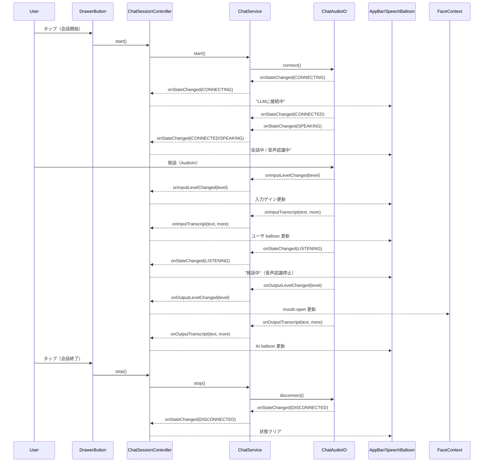

# ChatAudioIO + Stack-chan 統合設計

## 目的と前提
- Moddableの `ChatAudioIO` を Stack-chan に組み込み、音声双方向の会話を実現する。
- 参照元: `reference/moddable/contributed/conversationalAI` の構成と `ChatAudioIO` の状態遷移を踏襲する。
- エコーキャンセル未実装のため、Stack-chanが発話中は音声入力を停止する（`ChatAudioIO` の LISTENING/WAITING 振る舞いに合わせる）。
- 実装は `stackchan/services/` 配下の1サービスとして `chat` を追加し、内部で `ChatAudioIO` を import する。

## コンポーネント階層の差分（UI/状態連携）

### 現状（概略）
```
AppController
└─ FaceView (CommonView)
   ├─ MAIN (Face + Effects)
   ├─ APP_BAR (空コンテンツ)
   └─ OVERLAY (Drawer 用)
```

### 追加後（差分）
```
AppController
└─ FaceView (CommonView)
   ├─ MAIN (Face + Effects)
   ├─ APP_BAR
   │  └─ ChatStatusBar (状態アイコン + 入力ゲイン表示)
   └─ OVERLAY

Robot
└─ ChatSessionController (Robot/Mod側で実装)
   ├─ ChatService (new, stackchan/services/chat)
   │  └─ ChatAudioIO (Moddable)
   └─ UI更新（AppBar / SpeechBalloon / FaceContext）
```

### 差分ポイント（要求事項との対応）
- AppBar にチャット状態アイコンを追加。
  - 「LLMに接続中」「会話中」「音声認識中（+入力ゲイン）」「発話中（=音声認識停止中）」の視認性を担保。
- `ChatAudioIO` のコールバックは ChatService から上位（Robot/ChatSessionController）へ通知し、そこで faceContext と UI を更新する。
  - `onOutputLevelChanged` → `mouth.open` 反映（既存TTSの `volume/2000` スケール）。
- Drawer ボタンで会話開始/終了をトグル。
  - `connect()` / `disconnect()` を明示的に呼ぶ。
- Speech balloon を2つ用意してユーザ発話とAI応答を分離表示。
  - `onInputTranscript` はユーザ側 balloon、`onOutputTranscript` はAI側 balloon を更新（上位で処理）。

## Chat Service I/F 定義（stackchan/services/chat）

### 目的
- `ChatAudioIO` を直接UIから触らず、Stack-chan側の統一I/Fで制御する。
- 後述の「既存 STT+AI+TTS パイプライン」も同じI/Fで差し替え可能にする。

### 型/クラス案（設計レベル）
```ts
export type ChatState =
  | "FAILED"
  | "DISCONNECTED"
  | "DISCONNECTING"
  | "CONNECTING"
  | "CONNECTED"
  | "SPEAKING"   // ユーザ発話（入力有効）
  | "LISTENING"  // AI発話（入力停止）
  | "WAITING";   // 出力再生完了待ち

export type ChatConfig = {
  specifier: "deepgramAgent" | "elevenLabsAgent" | "googleGeminiLive" | "humeAIEVI" | "openAIRealtime";
  instructions?: string;
  voiceID?: string;
  providerID?: string;
  modelID?: string;
};

export type ChatToolSchema = {
  name: string;
  description?: string;
  parameters: {
    type: "object";
    properties: Record<string, { type: string; description?: string }>;
    required?: string[];
    additionalProperties?: boolean;
  };
};

export type ChatTool = ChatToolSchema & {
  execute?: (params: Record<string, unknown>) => Promise<unknown> | unknown;
};

export type ChatCallbacks = {
  onStateChanged?: (state: ChatState, error?: string) => void;
  onInputLevelChanged?: (level: number) => void;
  onOutputLevelChanged?: (level: number) => void;
  onInputTranscript?: (text: string, more: boolean) => void;
  onOutputTranscript?: (text: string, more: boolean) => void;
  onFunctionCall?: (call: string, name: string, params: Record<string, unknown>) => void;
};

export class ChatService {
  constructor(options: {
    config: ChatConfig;
    tools?: Record<string, ChatTool>;
    callbacks?: ChatCallbacks;
  });

  start(): void;           // ChatAudioIO.connect()
  stop(): void;            // ChatAudioIO.disconnect()
  close(): void;           // Worker terminate / audio close
  sendText(text: string): void;
  sendFunctionResult(call: string, name: string, result: unknown): void;
  setMicrophoneEnabled(enabled: boolean): void; // ChatAudioIO.changeMicrophone
  setVolume(volume: number): void;               // ChatAudioIO.changeVolume
  get state(): ChatState;
}
```

補足:
- `tools` は `Dialogue` と同様に Tool 型で定義し、`ChatAudioIO` には `functions` 配列として渡す。
- `onFunctionCall` を受けた後の `execute` 実行や `sendFunctionResult` の送信は、ChatSessionController で制御する（ChatServiceはUI/ロボットへの依存を持たない）。

### `mc/config` で渡す設定
既存実装との一貫性を保ち、`config.chat` を新設して ChatAudioIO の `specifier / modelID / voiceID / instructions` を受け取る。

例:
```
config: {
  chat: {
    specifier: "openAIRealtime",
    modelID: "gpt-realtime-mini",
    voiceID: "marin",
    instructions: "...",
  }
}
```

APIキーは ChatAudioIO 標準方式に従い、`mc/config` に `openAIKey / geminiAPIKey / deepgramKey / elevenLabsKey / humeAIKey` を設定する。
ファイルに書かずコマンドラインから渡す場合は、`mcconfig` の `key=value` 指定で上書きする。

## 状態表示（AppBar）設計
※ ChatService は UI を知らないため、状態反映は Robot/ChatSessionController で行う。

### 状態マッピング
- CONNECTING / DISCONNECTING: 「LLMに接続中」アイコン + ローディング表示
- CONNECTED / WAITING: 「会話中」アイコン（待機中）
- SPEAKING: 「音声認識中」アイコン + 入力ゲイン（level bar or numeric）
- LISTENING: 「発話中」アイコン（音声認識停止中）
- FAILED: エラーアイコン + メッセージ（短文）

### 入出力レベル表示
- `onInputLevelChanged(level)` は AppBar の入力ゲイン表示へ反映。
- `onOutputLevelChanged(level)` は `faceContext.mouth.open` へ反映。
  - 既存TTSと同じスケール: `mouthOpen = min(level / 2000, 1.0)` を推奨。

## 会話開始/終了のシーケンス（Drawer ボタン）



## 既存「STT+AI+TTS」パイプライン対応方針

### 方針
- `ChatService` のI/Fを共通化し、バックエンド差し替えで実装を置換可能にする。
- ChatAudioIO 版と Legacy 版の2実装を用意し、UI/FaceContext更新は共通の `ChatSessionController` で吸収する。

### 具体案
1. **共通I/Fの確定**
   - `start/stop/sendText/state/level/transcript` を共通化。
   - `ChatState` を ChatAudioIO の状態に合わせて定義。
2. **ChatAudioIO 実装**
   - そのまま `ChatAudioIO` のイベントを流す。
3. **Legacy パイプライン実装**
   - `Microphone.record()` -> `STT.transcribe()` -> `Dialogue.post()` -> `TTS.stream()` を1会話単位にまとめる。
   - 状態マッピング例:
     - CONNECTING: ネットワーク準備開始
     - SPEAKING: 録音中
     - LISTENING: TTS再生中
     - WAITING: 応答生成待ち
   - `onOutputLevelChanged` は `tts.onPlayed` の volume を流用。
   - `onInputLevelChanged` はマイク入力が取得可能ならVU計算、不可なら非表示。
4. **UI/FaceContextの共通化**
   - AppBar / SpeechBalloon / mouth.open 更新は `ChatSessionController` 経由で実装する。
   - バックエンド差し替えでも UI が同一動作になるよう、イベント契約を固定する。

## 補足: 参照実装との差分意識点
- conversationalAI は `LISTENING` 中に `AudioIn` を停止する設計。Stack-chan でも同じ扱いにする。
- `ChatAudioIO` は `WAITING` -> バッファ枯渇後に `SPEAKING` へ復帰するため、UIは WAITING を「会話中（待機）」として扱うのが自然。

## 実装計画（タスクリスト）
1. **ChatService 定義**
   - `stackchan/services/chat` を新設し、`ChatService` の I/F と `ChatState` を実装。
   - `ChatTool` / `ChatToolSchema` を定義し、`tools` 辞書 → `ChatAudioIO.functions` 変換を実装。
2. **ChatAudioIO 統合**
   - `ChatAudioIO` の import と生成、`connect/disconnect/sendText/sendFunctionResult` をラップ。
   - `onStateChanged / onInputLevelChanged / onOutputLevelChanged / onInputTranscript / onOutputTranscript / onFunctionCall` を上位コールバックへ中継。
3. **設定の配線**
   - `config.chat` を `mc/config` から読み込むユーティリティ（`loadPreferences` 相当）を用意。
   - CLI 上書き前提（`mcconfig key=value`）のドキュメント注記を追加。
4. **ChatSessionController（Robot/Mod）**
   - `ChatService` を保持し、Drawer ボタンから `start/stop` を呼ぶ制御層を追加。
   - `onFunctionCall` の受信 → `tools[name].execute()` → `sendFunctionResult()` を実装。
5. **UI 状態表示（AppBar）**
   - `ChatStatusBar` を AppBar に追加し、状態アイコン/ラベル/入力ゲイン表示を実装。
   - `ChatState` から UI 状態へのマッピングを `ChatSessionController` に実装。
6. **Speech balloon 表示**
   - ユーザ/AI で別バルーンを持ち、`onInputTranscript`/`onOutputTranscript` で更新。
   - スクロールやクリア条件（disconnect時）を整理。
7. **口パク連動**
   - `onOutputLevelChanged` → `mouth.open` を更新（`min(level/2000, 1.0)`）。
8. **既存 STT+AI+TTS との共通I/F**
   - Legacy 実装を `ChatService` と同一I/Fでラップし、切替可能にする。
   - 状態マッピング・レベル/トランスクリプトの擬似イベントを定義。
9. **最小動作確認**
   - connect/disconnect と状態遷移、AppBar表示、バルーン更新、口パクを順に確認。

## テスト計画（タスク別: 正常系/異常系）
> すべて `tests/chats/` 配下に追加する想定。各タスクの成果を独立して検証できる粒度で書く。

### 1. ChatService 定義
- 正常系
  - `ChatService` が `tools` 辞書を `functions` 配列へ正しく変換する（name/description/parameters）。
  - `ChatService` が `state` を公開し、初期値が `DISCONNECTED` になる。
- 異常系
  - `tools` に未知/空の値が含まれても変換が落ちない（空配列扱い）。
  - `callbacks` 未指定でも例外にならない。

### 2. ChatAudioIO 統合
- 正常系
  - `start()` が `connect()` を呼び、`onStateChanged(CONNECTING→CONNECTED)` を中継。
  - `stop()` が `disconnect()` を呼び、`onStateChanged(DISCONNECTING→DISCONNECTED)` を中継。
  - `sendText()` が `ChatAudioIO.sendText()` を呼ぶ。
- 異常系
  - 未接続状態で `sendText()` を呼ぶとエラー/拒否が上位へ伝搬する。
  - `ChatAudioIO` が `FAILED` を返すと `error` が `onStateChanged` へ伝播する。

### 3. 設定の配線
- 正常系
  - `config.chat` が `ChatService` へ渡される（specifier/modelID/voiceID/instructions）。
  - CLI 上書き値が `mc/config` 経由で反映される（値の優先順位検証）。
- 異常系
  - `config.chat` が無い場合でもデフォルト構成で起動できる。
  - 不正な `specifier` で起動した場合に `FAILED` へ遷移する。

### 4. ChatSessionController（Robot/Mod）
- 正常系
  - Drawer ボタンで `start/stop` が呼ばれ、状態がトグルされる。
  - `onFunctionCall` → `tools[name].execute()` → `sendFunctionResult()` の連鎖が動く。
- 異常系
  - `execute()` が例外/Promise reject でもサービスが落ちずエラーを返せる。
  - `tools` 未登録の `name` を受けた場合のフォールバック動作（無視/エラー返信）。

### 5. UI 状態表示（AppBar）
- 正常系
  - CONNECTING/DISCONNECTING で「接続中」表示。
  - SPEAKING/LISTENING/WAITING で状態表示が切替わる。
  - 入力ゲインが AppBar に反映される。
- 異常系
  - 状態不明/未定義の値が来ても UI が壊れない（無視 or デフォルト表示）。
  - 連続状態遷移（CONNECTING→FAILED 等）で表示が破綻しない。

### 6. Speech balloon 表示
- 正常系
  - `onInputTranscript` がユーザ側、`onOutputTranscript` がAI側に表示される。
  - `more=true` で追記・`more=false` で確定する。
  - `disconnect` 時にバルーンをクリアできる。
- 異常系
  - 空文字/短文連続で表示が崩れない。
  - 超長文で UI が落ちない（切り詰め/スクロール）。

### 7. 口パク連動
- 正常系
  - `onOutputLevelChanged` に応じて `mouth.open` が `0..1` にクランプされる。
  - 出力完了で `mouth.open` が 0 に戻る。
- 異常系
  - `level` が負/異常値でもクランプされる。
  - `LISTENING` 以外でレベルイベントが来ても破綻しない。

### 8. 既存 STT+AI+TTS との共通I/F
- 正常系
  - Legacy 実装が `ChatService` と同じ I/F で動作する。
  - 状態マッピングが UI 表示に反映される。
- 異常系
  - STT/LLM/TTS の各段階で失敗した場合に `FAILED` へ遷移しエラー表示される。
  - 途中で `stop()` した場合に処理が中断される。

### 9. 最小動作確認（統合）
- 正常系
  - start → 発話 → 応答 → stop のフローが1回通る。
  - AppBar/バルーン/口パクが一貫して更新される。
- 異常系
  - start 直後に stop してもクラッシュしない。
  - ネットワーク断/タイムアウトで `FAILED` を適切に表示する。

## テスト実ファイル設計（tests/chats）
> 既存のテスト構成に合わせ、**Node単体テスト**と**Moddable実機/シミュレータ用テスト**を分離する。

```
tests/chats/
  README.md
  unit/
    01-chat-service.test.ts
    02-chat-audioio-bridge.test.ts
    03-chat-config.test.ts
    04-chat-session-controller.test.ts
    05-chat-mouth-sync.test.ts
    06-legacy-adapter.test.ts
  integration/
    chat-statusbar/
      main.ts
      manifest.json
    chat-balloon/
      main.ts
      manifest.json
    chat-e2e/
      main.ts
      manifest.json
  mocks/
    fake-chataudioio.ts
    fake-drawer.ts
    fake-appbar.ts
    fake-balloon.ts
    fake-tools.ts
    fake-tts-stt-dialogue.ts
```

### README.md
- **内容**: 目的、実行方法、前提（APIキー/ネットワーク不要のテストはMockで完結）。
- **補足**: Nodeテストは `tsconfig.test.json` の include に `tests/chats/unit/**/*.ts` を追加する必要がある。

### unit/01-chat-service.test.ts
- **対象タスク**: 1. ChatService 定義
- **構造**:
  - `tools` 辞書 → `functions` 配列の変換テスト
  - `state` 初期値/遷移中継テスト
- **モック戦略**:
  - `FakeChatAudioIO` を注入（コンストラクタで差し替え可能な seam を設計）
  - `callbacks` は `vi`/`sinon` 不使用で、素の関数と配列ログで確認

### unit/02-chat-audioio-bridge.test.ts
- **対象タスク**: 2. ChatAudioIO 統合
- **構造**:
  - `start/stop/sendText/sendFunctionResult` の呼び出し中継
  - `onStateChanged / onInputLevelChanged / onOutputLevelChanged / onInputTranscript / onOutputTranscript` の中継
- **モック戦略**:
  - `FakeChatAudioIO` の `emitXxx()` でイベントを擬似発火
  - 呼ばれた引数をログ配列で検証

### unit/03-chat-config.test.ts
- **対象タスク**: 3. 設定の配線
- **構造**:
  - `config.chat` が `ChatService` に渡る
  - `specifier/modelID/voiceID/instructions` の優先順検証
- **モック戦略**:
  - `loadPreferences` 相当は引数注入 or 関数差し替えで擬似設定を渡す
  - CLI上書きは `mc/config` の期待値を fixture 化

### unit/04-chat-session-controller.test.ts
- **対象タスク**: 4. ChatSessionController
- **構造**:
  - Drawer ボタン → `start/stop` トグル
  - `onFunctionCall` → `execute()` → `sendFunctionResult()` の連鎖
- **モック戦略**:
  - `FakeDrawerRegistry` で `addDrawerButton`/`setDrawerButtonState` を記録
  - `FakeTools` で成功/失敗の両パスを作る

### unit/05-chat-mouth-sync.test.ts
- **対象タスク**: 7. 口パク連動
- **構造**:
  - `level` → `mouth.open` のクランプ/スケール
  - 出力終了時の `mouth.open = 0`
- **モック戦略**:
  - `FaceContext` は最小構造体（`mouth.open` のみ）
  - `ChatSessionController` に level イベントだけ注入

### unit/06-legacy-adapter.test.ts
- **対象タスク**: 8. 既存 STT+AI+TTS との共通I/F
- **構造**:
  - Legacy 実装が `ChatService` と同じI/Fを満たすことを確認
  - 状態マッピング/エラー経路テスト
- **モック戦略**:
  - `FakeSTT/FakeDialogue/FakeTTS` で成功/失敗を再現
  - 例外や reject を明示的に投げる

### integration/chat-statusbar
- **対象タスク**: 5. UI 状態表示（AppBar）
- **構造**:
  - `ChatState` を順に送って表示切替を確認（traceで状態ログ）
  - 入力ゲイン表示の更新確認
- **モック戦略**:
  - `FakeChatAudioIO` を使い状態とレベルを順次 emit
  - 描画は `trace()` ベースの確認（他テストと同様）

### integration/chat-balloon
- **対象タスク**: 6. Speech balloon 表示
- **構造**:
  - `onInputTranscript/onOutputTranscript` による更新を確認
  - `more=true/false` の挙動確認
- **モック戦略**:
  - `FakeChatAudioIO` で transcript を emit
  - 既存 `SpeechBalloon` と同様の描画サンプルで `trace()` 確認

### integration/chat-e2e
- **対象タスク**: 9. 最小動作確認（統合）
- **構造**:
  - start → speaking → listening → stop の一連フロー
  - AppBar/バルーン/口パクの更新を trace
- **モック戦略**:
  - ネットワーク不要の `FakeChatAudioIO` スクリプト再生
  - 失敗ケース（FAILED）を1回挟む

### mocks/ の方針
- `fake-chataudioio.ts`: `connect/disconnect/sendText/sendFunctionResult` と `emit*` を持つ軽量スタブ。
- `fake-drawer.ts`: Drawer ボタン登録/状態変更の記録のみ実装。
- `fake-appbar.ts`: 状態・ゲインの受け取り用データクラス（Piu非依存）。
- `fake-balloon.ts`: `updateUser/updateAgent/clear` を記録するだけのスタブ。
- `fake-tools.ts`: `execute()` の成功/失敗を切り替えできる fixture。
- `fake-tts-stt-dialogue.ts`: Legacy 経路の擬似実装。
